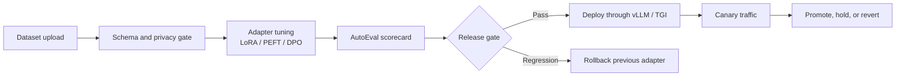
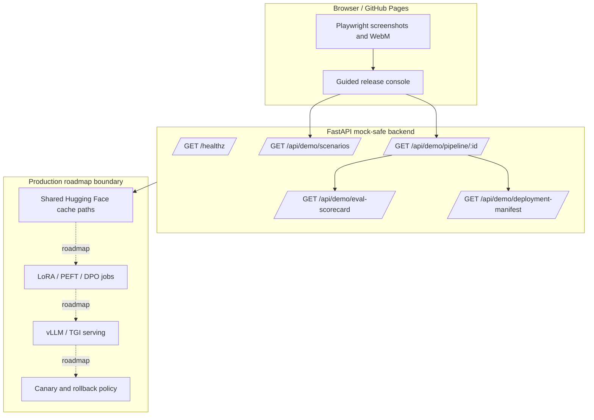
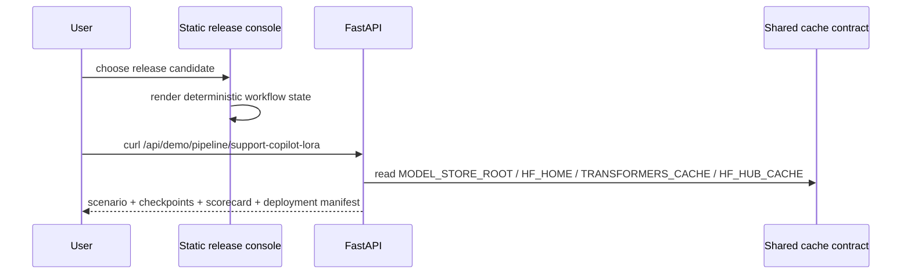
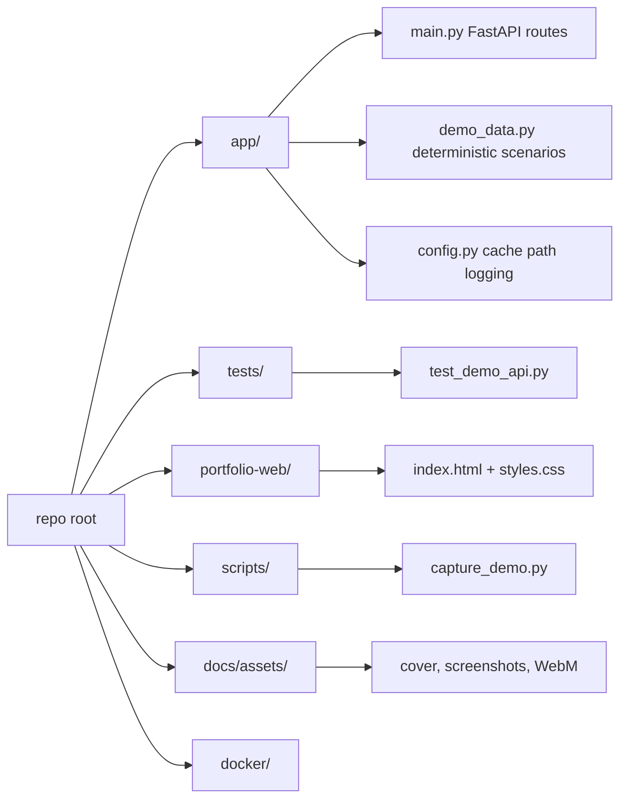
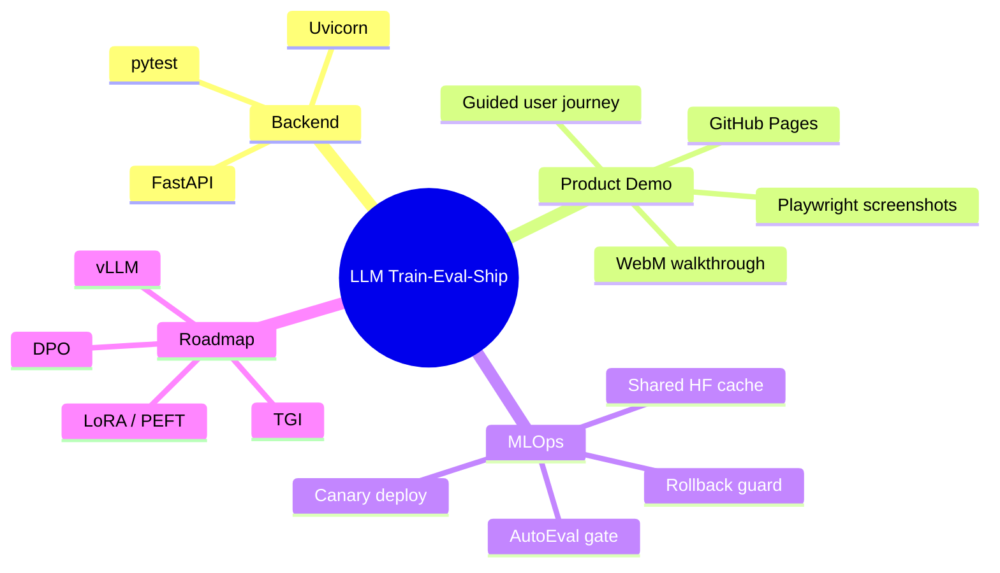
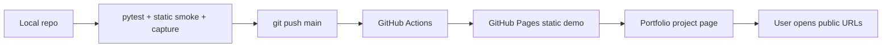

# LLM Train-Eval-Ship

> A portfolio-ready, mock-safe LLM MLOps release console that demonstrates the path from dataset readiness to adapter tuning, automated evaluation, canary deployment, and rollback decisions.


## Product Positioning

LLM Train-Eval-Ship is a **guided LLM release operations prototype**. Real large-model training usually needs GPUs, private datasets, model weights, and production serving infrastructure. This project focuses on the parts users can safely inspect in public: release gates, evaluation evidence, deployment decisions, shared model-cache governance, and rollback readiness.

| Area | What users can inspect | Status |
| --- | --- | --- |
| Backend service | FastAPI health check, demo scenarios, pipeline run, eval scorecard, deployment manifest | Complete |
| Mock-safe journey | Full release workflow without GPUs, API keys, model weights, or external services | Complete |
| Static product demo | GitHub Pages guided release console with the actual workflow on the first screen | Complete |
| Verification | pytest backend smoke tests, static smoke, Docker build, Playwright screenshots, WebM capture | Complete |
| Real model execution | LoRA/PEFT, DPO, vLLM/TGI production wiring | Roadmap |

## Public Entry Points

| Resource | URL |
| --- | --- |
| Interactive demo | https://justin21523.github.io/LLM-train-eval-ship/ |
| Portfolio case study | https://justin21523.github.io/zh-TW/projects/llm-train-eval-ship/ |
| GitHub repository | https://github.com/Justin21523/LLM-train-eval-ship |

## User Journey

1. Open the interactive demo and start the guided release walkthrough.
2. Choose one of three release candidates: Support Copilot LoRA, Policy DPO Safety Pass, or RAG Agent Regression Gate.
3. Follow the checkpoint lane: dataset readiness, adapter registration, AutoEval, and release decision.
4. Inspect the user decision panel to promote, hold, or roll back the adapter.
5. Review the README diagrams and API contracts to understand the system boundary.



## System Architecture



## Data And Control Flow



## Module Organization



## Technology Stack

| Layer | Technology | Purpose |
| --- | --- | --- |
| Backend | Python, FastAPI, Uvicorn | Demo API, health check, pipeline contract |
| Test | pytest, FastAPI TestClient | Smoke tests |
| Static demo | HTML, CSS, Vanilla JS | GitHub Pages guided product journey |
| Media automation | Playwright, FFmpeg | Screenshot assets and WebM walkthrough |
| Deployment | GitHub Actions, GitHub Pages, Docker, Nginx | Static deployment and local container smoke |
| LLM roadmap | Hugging Face cache, LoRA/PEFT, DPO, vLLM, TGI | Production extension points |



## API Contract

| Method | Endpoint | Purpose |
| --- | --- | --- |
| GET | `/healthz` | Service status, demo mode, cache paths |
| GET | `/api/demo/scenarios` | Release candidates for the guided journey |
| GET | `/api/demo/pipeline/{scenario_id}` | Scenario, checkpoints, scorecard, and deployment manifest |
| GET | `/api/demo/eval-scorecard` | Mock AutoEval scorecard |
| GET | `/api/demo/deployment-manifest` | vLLM/TGI, canary, and rollback manifest |

## Local Backend

```bash
python3 -m venv .venv
source .venv/bin/activate
pip install -r requirements.txt

export DEMO_MODE=mock
export MODEL_STORE_ROOT=/srv/model-store
export HF_HOME=/srv/model-store/hf-home
export TRANSFORMERS_CACHE=/srv/model-store/hf-cache
export HF_HUB_CACHE=/srv/model-store/hf-cache

uvicorn app.main:app --host 127.0.0.1 --port 8080
```

```bash
curl http://127.0.0.1:8080/healthz
curl http://127.0.0.1:8080/api/demo/pipeline/support-copilot-lora
```

## Static Demo

```bash
python3 -m http.server 4177 --directory portfolio-web
# open http://127.0.0.1:4177/
```

## Testing And Asset Capture

```bash
python3 -m pytest
python3 scripts/capture_demo.py
docker build -f docker/portfolio.Dockerfile -t llm-train-eval-ship-demo .
```

Generated assets:

| Path | Purpose |
| --- | --- |
| `docs/assets/cover.png` | README and portfolio cover |
| `docs/assets/screenshots/*.png` | Portfolio media gallery screenshots |
| `docs/assets/demo/guided-demo.webm` | Guided walkthrough video |

## Deployment Flow



## Demo Scenarios

| Scenario | Model | Method | Gate | User decision |
| --- | --- | --- | --- | --- |
| Support Copilot LoRA | Qwen2.5-7B-Instruct | LoRA / PEFT | Helpfulness + latency | Promote to 20% canary |
| Policy DPO Safety Pass | Mistral-7B-Instruct | DPO | Safety refusal + jailbreak probes | Hold for policy approval |
| RAG Agent Regression Gate | Llama-3.1-8B-Instruct | Adapter refresh | Citation grounding + latency | Roll back adapter |

## Risks And Honest Boundaries

| Risk | Explanation | Current handling |
| --- | --- | --- |
| No GPU or model weights | Real LoRA/DPO training cannot run in the public static demo | Deterministic mock-safe workflow |
| External services unavailable | Hugging Face or serving endpoints may need credentials and large resources | Demo does not depend on external services |
| Production serving not wired | vLLM/TGI integration is a contract boundary, not a live serving claim | UI and README label it as roadmap |
| Mock evaluation data | Scorecard demonstrates architecture, not real model quality | API returns `mode=mock` and `runtime=mock-safe` |

## What This Demonstrates

- Turning a thin FastAPI skeleton into a user-operable release journey.
- Handling common LLM demo constraints: GPUs, model weights, external services, secrets, and shared cache paths.
- Expressing production MLOps decisions through API contracts and mock-safe UI rather than a static marketing page.
- Producing reproducible screenshots and video assets with Playwright and FFmpeg.
