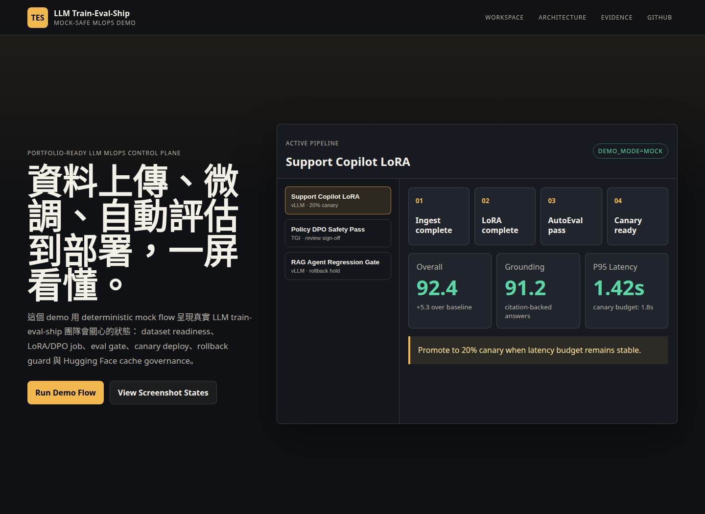
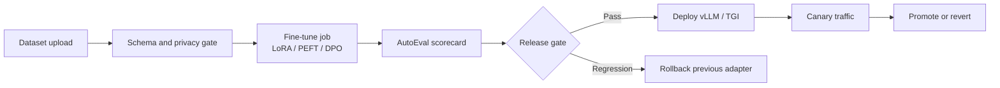
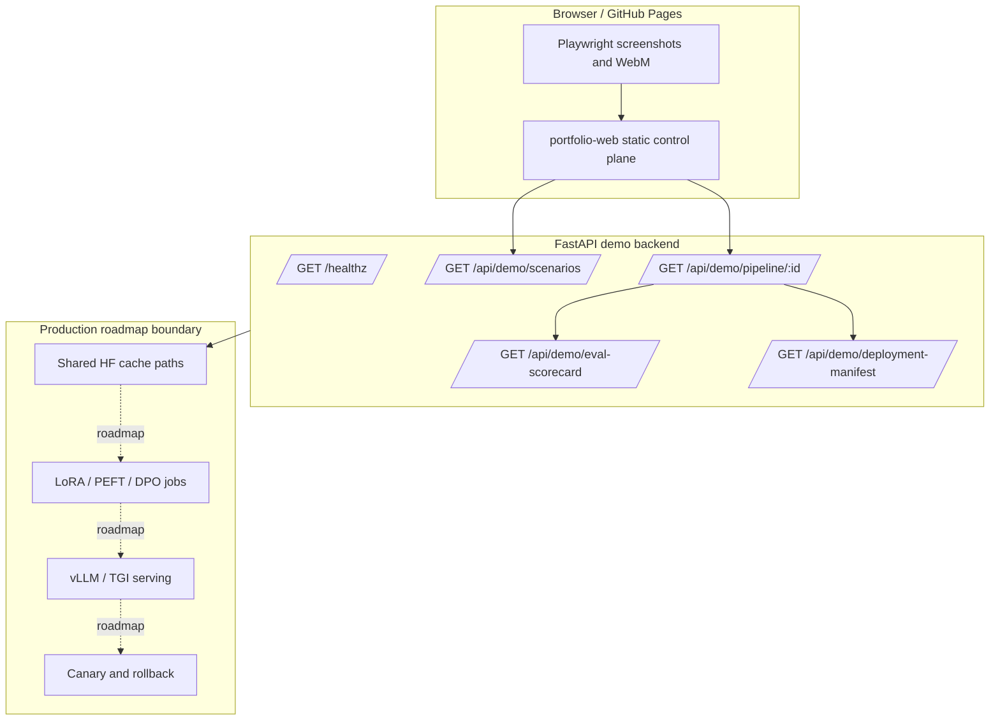
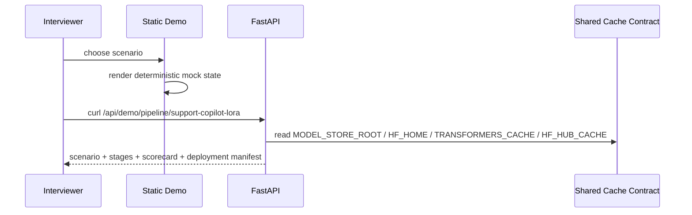
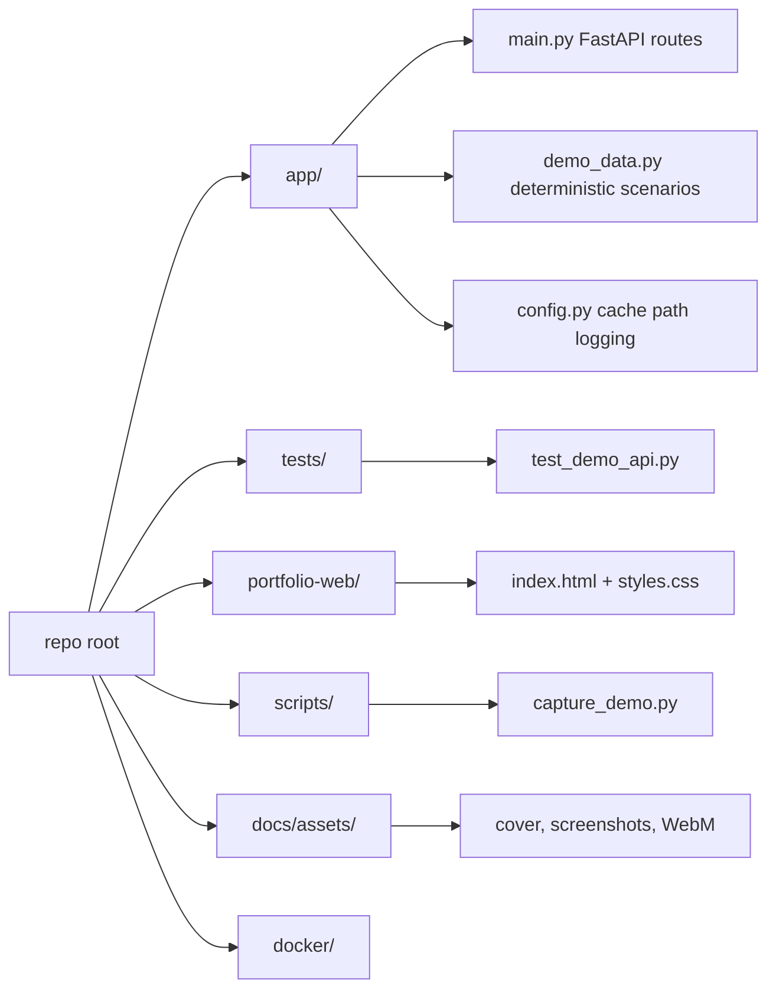
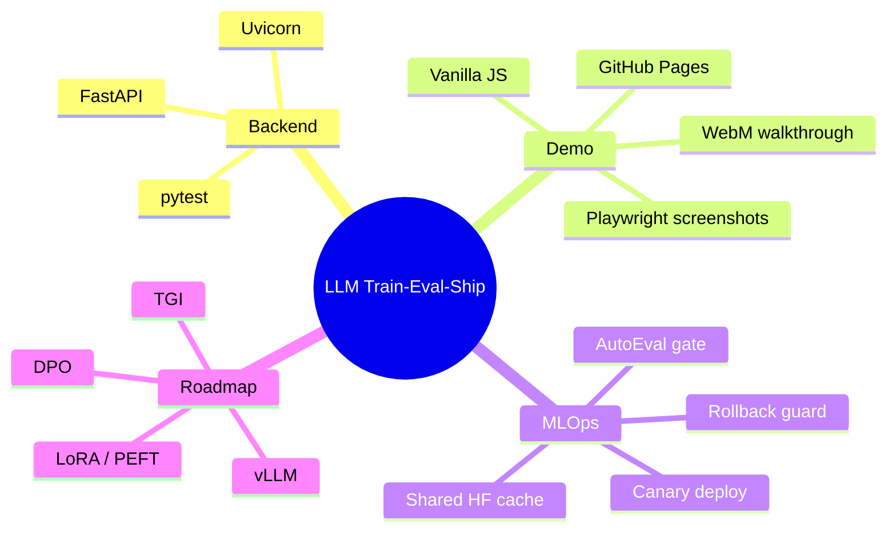
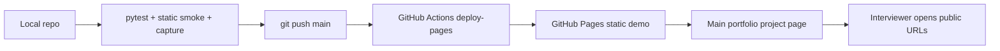

# LLM Train-Eval-Ship

> 可公開展示給面試官看的 LLM MLOps portfolio demo：用 mock-safe 模式呈現「資料上傳 → 微調 → 自動評估 → 部署 → canary / rollback」的完整工程脈絡。



## 專案定位

LLM Train-Eval-Ship 是一個 **LLM 工程化控制台原型**。真實訓練大型模型需要 GPU、模型權重、資料治理與部署環境；本專案先把面試展示最重要的工程面做完整：

| 面向 | 展示內容 | 目前狀態 |
| --- | --- | --- |
| 後端服務 | FastAPI health check、demo scenarios、pipeline run、eval scorecard、deployment manifest | 已完成 |
| Mock-safe demo | 不需要 GPU、API key、模型權重或外部服務即可展示完整流程 | 已完成 |
| 靜態作品頁 | GitHub Pages 可部署的互動控制台，第一屏直接呈現產品本體 | 已完成 |
| 測試 | pytest backend smoke tests、static smoke、Docker build、Playwright capture | 已完成 |
| 真實模型訓練 | LoRA/PEFT、DPO、vLLM/TGI production wiring | Roadmap |

## Demo 入口

| 資源 | URL |
| --- | --- |
| Interactive Demo | https://justin21523.github.io/LLM-train-eval-ship/ |
| Portfolio Case Study | https://justin21523.github.io/zh-TW/projects/llm-train-eval-ship/ |
| GitHub Repo | https://github.com/Justin21523/LLM-train-eval-ship |

## 面試官 90 秒導覽

1. 打開 Interactive Demo，第一屏就是 LLM MLOps control plane。
2. 點選三個 scenario：Support Copilot LoRA、Policy DPO Safety Pass、RAG Agent Regression Gate。
3. 觀察每個 scenario 的 pipeline stage、AutoEval scorecard、latency budget、canary/rollback decision。
4. 回到 README 看 Mermaid 架構圖與 API 表，確認這不是純 marketing page，而是有 backend contract、test、capture assets、deploy flow 的可展示專案。



## 系統架構



## 資料流與控制流



## 模組組織



## 技術 Stack

| Layer | Tech | 用途 |
| --- | --- | --- |
| Backend | Python, FastAPI, Uvicorn | Demo API、health check、pipeline contract |
| Test | pytest, FastAPI TestClient | smoke tests |
| Static demo | HTML, CSS, Vanilla JS | GitHub Pages interactive demo |
| Media automation | Playwright, FFmpeg | screenshot assets 與 demo WebM |
| Deployment | GitHub Actions, GitHub Pages, Docker, Nginx | static demo deployment and local container smoke |
| LLM roadmap | Hugging Face cache, LoRA/PEFT, DPO, vLLM, TGI | 真實 production extension points |



## API

| Method | Endpoint | 說明 |
| --- | --- | --- |
| GET | `/healthz` | 服務狀態、demo mode、cache paths |
| GET | `/api/demo/scenarios` | 三個展示 scenario |
| GET | `/api/demo/pipeline/{scenario_id}` | scenario、pipeline stages、scorecard、deployment manifest |
| GET | `/api/demo/eval-scorecard` | AutoEval mock scorecard |
| GET | `/api/demo/deployment-manifest` | vLLM/TGI、canary、rollback manifest |

## 本機啟動

```bash
python3 -m venv .venv
source .venv/bin/activate
pip install -r requirements.txt

export DEMO_MODE=mock
export MODEL_STORE_ROOT=/srv/model-store
export HF_HOME=/srv/model-store/hf-home
export TRANSFORMERS_CACHE=/srv/model-store/hf-cache
export HF_HUB_CACHE=/srv/model-store/hf-cache

uvicorn app.main:app --host 127.0.0.1 --port 8080
```

```bash
curl http://127.0.0.1:8080/healthz
curl http://127.0.0.1:8080/api/demo/pipeline/support-copilot-lora
```

## 靜態 Demo

```bash
python3 -m http.server 4177 --directory portfolio-web
# open http://127.0.0.1:4177/
```

## 測試與產生展示資產

```bash
python3 -m pytest
python3 scripts/capture_demo.py
docker build -f docker/portfolio.Dockerfile -t llm-train-eval-ship-demo .
```

產生的 assets：

| Path | 用途 |
| --- | --- |
| `docs/assets/cover.png` | README 與 portfolio cover |
| `docs/assets/screenshots/*.png` | Portfolio media gallery screenshots |
| `docs/assets/demo/guided-demo.webm` | 可錄影展示的 walkthrough |

## 部署圖



## Demo scenarios

| Scenario | Model | Method | Gate | Decision |
| --- | --- | --- | --- | --- |
| Support Copilot LoRA | Qwen2.5-7B-Instruct | LoRA / PEFT | Helpfulness + latency | Promote to 20% canary |
| Policy DPO Safety Pass | Mistral-7B-Instruct | DPO | Safety refusal + jailbreak probes | Ship after review sign-off |
| RAG Agent Regression Gate | Llama-3.1-8B-Instruct | Adapter refresh | Citation grounding + latency | Hold and rollback |

## 風險與誠實標示

| 風險 | 說明 | 目前處理 |
| --- | --- | --- |
| 無 GPU / 無模型權重 | 真實 LoRA/DPO 訓練無法在公開 demo 執行 | 提供 mock-safe deterministic pipeline |
| 外部服務不可用 | Hugging Face / model serving endpoint 可能需要金鑰或大型資源 | Demo 不依賴外部服務 |
| Production serving 尚未接線 | vLLM/TGI 是 extension contract，不是假裝已上線 | README 與 UI 明確標示 roadmap |
| 評估資料為 mock | Scorecard 用於展示架構，不代表真模型分數 | API 回傳 `mode=mock` 與 `runtime=mock-safe` |

## 面試亮點

- 把一個薄 FastAPI skeleton 補成可展示、可測試、可部署、可截圖錄影的 portfolio demo。
- 明確處理 LLM 專案常見限制：GPU、模型權重、外部服務、金鑰、重複下載 cache。
- 用 API contract 和 mock-safe UI 表達 production MLOps 邏輯，而不是只做靜態 marketing。
- 用 Playwright + FFmpeg 產出可重現的 screenshots 與 demo video assets。
